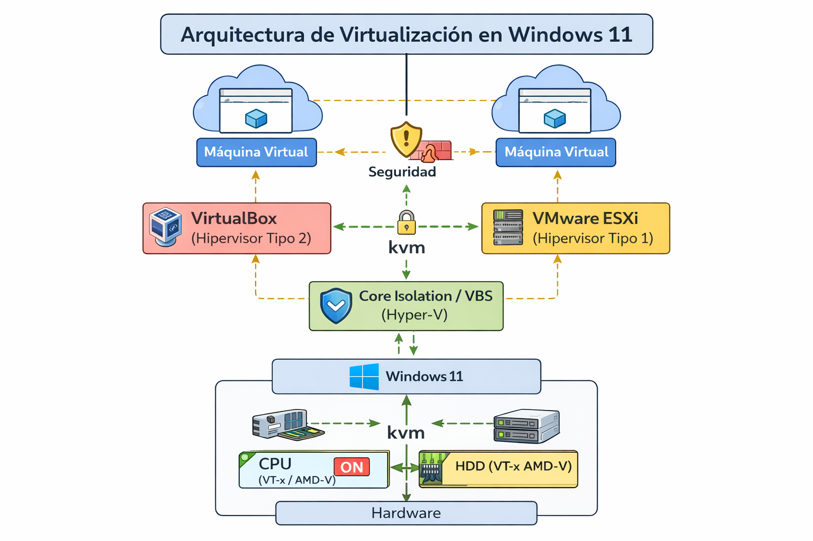
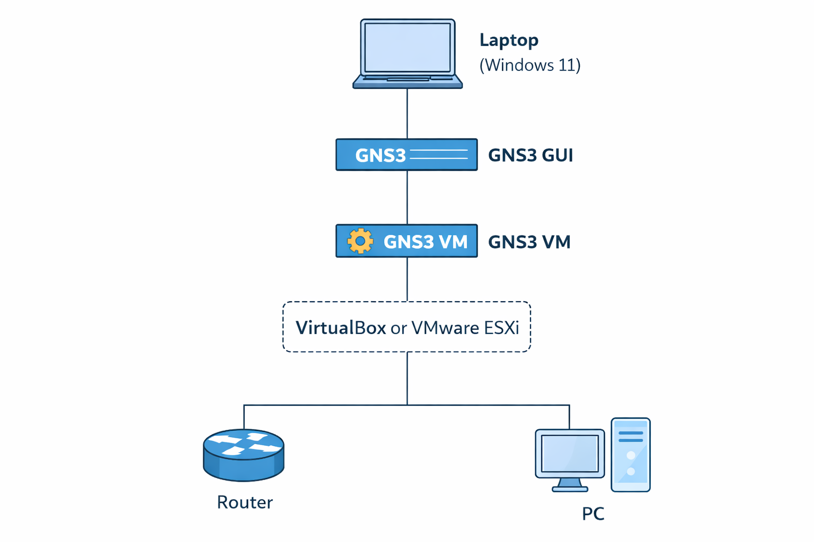

## 🖥️ 1. Arquitectura de Virtualización en Windows 11

### 🔐 Aislamiento de Núcleo (Core Isolation) y VBS

El **Core Isolation** y **VBS (Virtualization-Based Security)** son tecnologías de seguridad de Windows 11 que utilizan virtualización para proteger procesos críticos del sistema operativo. Estas funciones crean un entorno aislado donde se ejecutan componentes sensibles, evitando que malware los comprometa.

🔎 **¿Por qué afecta a GNS3 y VirtualBox?**
Porque estas tecnologías utilizan **Hyper-V** de forma interna. Hyper-V toma el control de la virtualización del hardware (VT-x/AMD-V), lo que impide que otros hipervisores como VirtualBox o incluso la GNS3 VM puedan acceder directamente a estas instrucciones.

⚠️ **Consecuencia:**

* GNS3 VM no puede usar KVM correctamente
* Aparece: *KVM support available: False*
* Bajo rendimiento o fallos

✅ **Conclusión:**
Se recomienda desactivar estas funciones cuando se trabaje con GNS3, ya que priorizar la virtualización directa del hardware mejora significativamente el rendimiento.

---

### ⚙️ Activación de VT-x / AMD-V

La virtualización por hardware (VT-x en Intel o AMD-V en AMD) permite que el procesador ejecute múltiples sistemas operativos de forma eficiente.

🔎 **¿Por qué es importante?**
Sin estas tecnologías, la virtualización se realiza por software, lo cual es mucho más lento e ineficiente. GNS3 depende de estas extensiones para ejecutar dispositivos de red de manera realista.

⚠️ **Si no está activado:**

* Las máquinas virtuales no arrancan correctamente
* KVM no funciona
* Simulaciones lentas

✅ **Conclusión:**
Activar VT-x/AMD-V es obligatorio para obtener un entorno de simulación estable y de alto rendimiento.

---

## ⚙️ 2. GNS3 VM: El Motor de Simulación

### 🧠 KVM (Kernel-based Virtual Machine)

KVM es una tecnología de virtualización integrada en el kernel de Linux que permite ejecutar máquinas virtuales con acceso directo al hardware.

🔎 **¿Por qué debe estar en TRUE?**
Porque cuando KVM está activo, la GNS3 VM utiliza virtualización acelerada por hardware, lo que permite:

* Mejor rendimiento
* Menor uso de CPU
* Ejecución fluida de routers y switches

⚠️ **Si está en FALSE:**

* Se usa emulación (mucho más lenta)
* Las simulaciones se vuelven inestables
* Alto consumo de recursos

✅ **Conclusión:**
KVM en TRUE garantiza un entorno profesional y eficiente para laboratorios de red.

---

### 💻 Configuración de Recursos

Asignar CPU y RAM correctamente es clave para el rendimiento del sistema.

🔎 **¿Por qué no asignar todo?**
Porque Windows también necesita recursos para funcionar. Si se asigna demasiada RAM o CPU a la GNS3 VM, el sistema host puede volverse lento o inestable.

⚠️ **Problemas comunes:**

* Congelamientos
* Bajo rendimiento general
* Fallos en simulaciones

✅ **Conclusión:**
Se recomienda usar solo el 50% de los recursos disponibles para mantener un equilibrio entre rendimiento y estabilidad.

---

## 🧪 3. Integración con VirtualBox

### 🌐 Configuración de Red (Host-Only)

El adaptador Host-Only permite la comunicación entre el host (Windows) y la máquina virtual.

🔎 **¿Por qué es necesario?**
Porque GNS3 funciona con una arquitectura cliente-servidor:

* GUI (Windows)
* Server (GNS3 VM)

El adaptador Host-Only permite que ambos se comuniquen directamente sin depender de internet.

✅ **Conclusión:**
Es esencial para garantizar la conexión entre la interfaz gráfica y el motor de simulación.

---

### 🔍 Modo Promiscuo (Promiscuous Mode)

El modo promiscuo permite que una interfaz de red capture todo el tráfico que pasa por ella, no solo el dirigido específicamente a su dirección MAC.

🔎 **¿Por qué es importante en GNS3?**
Porque en redes reales, dispositivos como switches manejan tráfico de capa 2 (broadcast, VLANs, etc.). Para simular esto correctamente, la interfaz debe poder ver todo el tráfico.

⚠️ **Si no se activa:**

* Los dispositivos no se comunican correctamente
* Fallan VLANs y switching
* Tráfico incompleto

✅ **Conclusión:**
El modo promiscuo es fundamental para simular redes reales de manera precisa.

---

## 🌐 4. Integración con VMware ESXi

### 🧩 Arquitectura Cliente-Servidor

GNS3 separa la interfaz gráfica (cliente) del procesamiento (servidor).

🔎 **¿Por qué usar ESXi?**
Porque ESXi es un hipervisor tipo 1 (bare-metal), lo que significa que se ejecuta directamente sobre el hardware, sin sistema operativo intermedio.

✅ **Ventajas:**

* Mayor rendimiento
* Mejor gestión de recursos
* Mayor estabilidad

---

### 🔐 Seguridad en vSwitch

ESXi implementa políticas de seguridad en sus switches virtuales.

🔎 **¿Por qué cambiar estas configuraciones?**

* **Promiscuous Mode:** permite capturar todo el tráfico
* **MAC Address Changes:** permite que una VM cambie su MAC
* **Forged Transmits:** permite enviar tráfico con MAC diferente

⚠️ **Si no se configuran:**

* GNS3 no funciona correctamente
* Tráfico bloqueado
* Fallos en simulación

✅ **Conclusión:**
Estas opciones deben habilitarse para permitir que GNS3 opere como una red real.

---

## 🛠️ Conclusión General

Cada configuración en GNS3 y los hipervisores no es arbitraria, sino que responde a la necesidad de replicar el comportamiento real de una red.

La correcta configuración de la virtualización, red y seguridad permite obtener un entorno estable, eficiente y cercano a un entorno profesional.

--- 

## 🛠️ 5. Matriz de Solución de Errores (Troubleshooting)

Durante la implementación de laboratorios en GNS3, es común enfrentar errores relacionados con la virtualización, red y permisos del sistema. A continuación, se presenta una matriz con problemas reales, su causa técnica y la solución aplicada.

| Error Detectado                                          | Causa Técnica (¿Por qué ocurre?)                                                                                                                                                                                                                      | Solución Implementada                                                                                                             |
| -------------------------------------------------------- | ----------------------------------------------------------------------------------------------------------------------------------------------------------------------------------------------------------------------------------------------------- | --------------------------------------------------------------------------------------------------------------------------------- |
| **KVM support available: False**                         | Este error ocurre porque el hipervisor (VirtualBox o ESXi) no está pasando las extensiones de virtualización (VT-x/AMD-V) a la GNS3 VM. Además, puede ser causado por la activación de Hyper-V en Windows, que bloquea el acceso directo al hardware. | Activar la virtualización en BIOS (VT-x/AMD-V), desactivar Hyper-V y habilitar la virtualización anidada (nested virtualization). |
| **No hay conectividad entre dispositivos (Router – VM)** | Esto sucede porque el adaptador de red no está en modo promiscuo, lo que impide que la interfaz capture tráfico de capa 2 necesario para la comunicación entre dispositivos virtuales.                                                                | Configurar el adaptador en VirtualBox con “Modo Promiscuo: Permitir todo” o verificar la correcta conexión en GNS3.               |
| **Error de conexión al servidor GNS3 (Puerto 3080)**     | El Firewall de Windows bloquea las peticiones hacia la API de GNS3, impidiendo la comunicación entre la GUI y la GNS3 VM.                                                                                                                             | Crear reglas en el firewall para permitir tráfico en el puerto 3080 y rango 5000-10000.                                           |
| **uBridge permission error**                             | Este error ocurre porque GNS3 no tiene permisos suficientes para ejecutar procesos de red a bajo nivel en el sistema operativo.                                                                                                                       | Ejecutar GNS3 como administrador o ajustar permisos del sistema.                                                                  |
| **Alto consumo de CPU / Lentitud**                       | Se produce cuando KVM no está activo o cuando se asignan demasiados recursos a la VM, provocando saturación del sistema host.                                                                                                                         | Verificar que KVM esté en TRUE y ajustar la asignación de CPU y RAM (máximo 50%).                                                 |

---

### 🔎 Análisis Técnico

La mayoría de errores en GNS3 están relacionados con la virtualización y la configuración de red. Esto se debe a que GNS3 intenta replicar un entorno de red real, lo cual requiere acceso directo al hardware y control completo del tráfico de red.

Si estos requisitos no se cumplen (por ejemplo, por restricciones del sistema operativo o mala configuración), el comportamiento de la red virtual se ve afectado.

---

### ✅ Conclusión

El troubleshooting no solo permite solucionar errores, sino también comprender el funcionamiento interno de GNS3 y los hipervisores. Identificar la causa raíz de los problemas es fundamental para implementar soluciones efectivas y mantener un entorno estable.

---

##  Diagramas

Coloca aquí tus imágenes:

---

## 📎 Referencias

- https://www.telectronika.com/articulos/ti/que-es-gns3/
- https://www.telectronika.com/tutoriales/gns3-tutorial-instalacion-configuracion/
- https://www.telectronika.com/tutoriales/gns3-vm-setup-wizard/

---

## 📚 Conclusiones

* GNS3 permite simulaciones avanzadas
* La virtualización es clave
* ESXi ofrece mejor rendimiento
* El troubleshooting es esencial

---

## 👨‍💻 Autor

Luis Miguel Huamani Garcia
